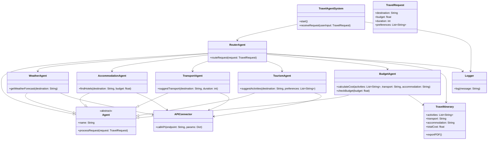

```mermaid
classDiagram
    %% Classe principal
    class TravelAgentSystem {
        +start()
        +receiveRequest(userInput: TravelRequest)
    }

    %% Classe que representa a requisição do usuário
    class TravelRequest {
        +destination: String
        +budget: float
        +duration: int
        +preferences: List~String~
    }

    %% Classe abstrata de agente
    class Agent {
        <<abstract>>
        +name: String
        +processRequest(request: TravelRequest)
    }

    %% Router Agent
    class RouterAgent {
        +routeRequest(request: TravelRequest)
    }

    %% Agentes específicos
    class WeatherAgent {
        +getWeatherForecast(destination: String)
    }

    class AccommodationAgent {
        +findHotels(destination: String, budget: float)
    }

    class TransportAgent {
        +suggestTransport(destination: String, duration: int)
    }

    class TourismAgent {
        +suggestActivities(destination: String, preferences: List~String~)
    }

    class BudgetAgent {
        +calculateCost(activities: List~String~, transport: String, accommodation: String)
        +checkBudget(budget: float)
    }

    %% Classe que representa o roteiro final
    class TravelItinerary {
        +activities: List~String~
        +transport: String
        +accommodation: String
        +totalCost: float
        +exportPDF()
    }

    %% Classes auxiliares
    class APIConnector {
        +callAPI(endpoint: String, params: Dict)
    }

    class Logger {
        +log(message: String)
    }

    %% Herança
    WeatherAgent --|> Agent
    AccommodationAgent --|> Agent
    TransportAgent --|> Agent
    TourismAgent --|> Agent
    BudgetAgent --|> Agent
    RouterAgent --|> Agent

    %% Relacionamentos
    TravelAgentSystem --> RouterAgent
    RouterAgent --> WeatherAgent
    RouterAgent --> AccommodationAgent
    RouterAgent --> TransportAgent
    RouterAgent --> TourismAgent
    RouterAgent --> BudgetAgent
    BudgetAgent --> TravelItinerary
    RouterAgent --> TravelItinerary
    WeatherAgent --> APIConnector
    AccommodationAgent --> APIConnector
    TransportAgent --> APIConnector
    TourismAgent --> APIConnector
    RouterAgent --> Logger
    TravelAgentSystem --> Logger


```