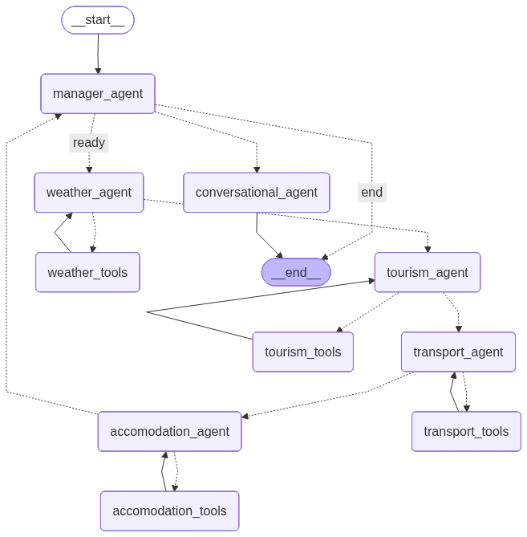

# Travel Agent IA

[](https://www.python.org/)
[](https://nextjs.org/)
[](https://github.com/langchain-ai/langgraph)
[](#)
[](LICENSE)

> 🌐 **English** · [Português](README.pt.md)

Multi-agent travel assistant powered by a local LLM (Ollama). You describe a trip in natural language and six specialized agents coordinate to return a plan covering flights, accommodation, weather, attractions and a budget estimate.

> **Active development.** Personal portfolio project. For now it lives only on GitHub, with no public deployment — to try it out you need to run it locally.

## Motivation

Most conversational assistant clones solve the problem with a single general-purpose model. This project explores the opposite path: split a complex task (planning a trip) into specialized agents, orchestrate them with LangGraph, and see how far you can go with a local LLM only (qwen2.5:7b via Ollama).

It also serves as a sandbox to study agentic AI patterns — parameter extraction, tool-use, conversational synthesis, observability — before applying them in professional contexts.

## Architecture

```
Travel-Agent/
├── backend/          Python · FastAPI · LangGraph · Ollama
│   └── src/
│       ├── agents/   Manager, Weather, Tourism, Transport, Accomodation, Budget, Conversational
│       ├── tools/    Wrappers for OpenWeatherMap, TripAdvisor, Booking.com
│       ├── prompts/  System prompts per agent
│       ├── graph/    LangGraph orchestration (StateGraph)
│       ├── api/      FastAPI REST server + auth middleware
│       └── db/       Migrations, chat_service, profile_service
└── frontend/         Next.js 16 · TypeScript · Tailwind · Framer Motion
    └── src/
        ├── app/      Pages (login, chat)
        ├── components/  UI (chat, sidebar, travel)
        ├── contexts/ AuthContext (Supabase Auth)
        ├── hooks/    useChat
        ├── lib/      Supabase client, API helpers
        └── types/    TypeScript interfaces
```

### LangGraph



**Flow:** User → ManagerAgent (extracts parameters) → WeatherAgent / TourismAgent / TransportAgent / AccomodationAgent / BudgetAgent (in parallel) → ConversationalAgent (synthesis) → Response

For a deeper architecture write-up, see [docs/ARCHITECTURE.md](docs/ARCHITECTURE.md).

## Prerequisites

- [Ollama](https://ollama.com) installed and running
- Python 3.12+ with [uv](https://docs.astral.sh/uv/)
- Node.js 18+
- A Supabase project (Auth + PostgreSQL)
- API keys: OpenWeatherMap and RapidAPI (TripAdvisor / Booking.com)

## Installation

### 1. Ollama + model

```bash
curl -fsSL https://ollama.com/install.sh | sh
ollama pull qwen2.5:7b
ollama serve
```

### 2. Backend

```bash
cd backend
uv sync

cp .env.example .env
# Fill .env with your keys

uv run uvicorn src.api.server:app --reload --port 8000
```

The server will be available at `http://localhost:8000`.
Interactive docs at `http://localhost:8000/docs`.

### 3. Frontend

```bash
cd frontend
npm install

cp .env.local.example .env.local
# Fill .env.local with your Supabase URL and anon key

npm run dev
```

Open `http://localhost:3000`.

## Environment variables

### Backend (`.env`)

| Variable | Description | Required |
|----------|-------------|----------|
| `OPENWEATHER_API_KEY` | OpenWeatherMap API key | Yes |
| `RAPID_KEY` | RapidAPI key (TripAdvisor / Booking) | Yes |
| `RAPID_HOST` | RapidAPI host | Yes |
| `OLLAMA_HOST` | Ollama URL (default: `http://localhost:11434`) | No |
| `SUPABASE_URL` | Supabase project URL | Yes |
| `SUPABASE_PASSWORD` | PostgreSQL database password | Yes |
| `SUPABASE_JWT_SECRET` | JWT secret for token validation | Yes |
| `SUPABASE_ANON_KEY` | Anon key (validation fallback) | No |

### Frontend (`.env.local`)

| Variable | Description | Required |
|----------|-------------|----------|
| `NEXT_PUBLIC_SUPABASE_URL` | Supabase project URL | Yes |
| `NEXT_PUBLIC_SUPABASE_ANON_KEY` | Supabase anon / public key | Yes |
| `NEXT_PUBLIC_API_URL` | Backend URL (default: `http://localhost:8000`) | No |

## REST API

### Public

| Method | Endpoint | Description |
|--------|----------|-------------|
| `GET` | `/health` | Health check |
| `POST` | `/api/auth/check-username` | Check if a username exists |
| `POST` | `/api/auth/resolve-username` | Resolve a username to an email |

### Authenticated (Bearer token)

| Method | Endpoint | Description |
|--------|----------|-------------|
| `POST` | `/api/chat` | Send a message to the agent |
| `GET` | `/api/sessions` | List the user's conversations |
| `GET` | `/api/sessions/{id}` | Load a conversation with its messages |
| `PATCH` | `/api/sessions/{id}` | Rename a conversation |
| `DELETE` | `/api/sessions/{id}` | Delete a conversation |

## Database (Supabase PostgreSQL)

| Table | Description |
|-------|-------------|
| `auth.users` | Users (managed by Supabase Auth) |
| `profiles` | Username, email (created via trigger on signup) |
| `chat_sessions` | Per-user conversations (title, timestamps) |
| `chat_messages` | Per-session messages (role, content) |

All tables have RLS enabled for per-user isolation.

## Agents

| Agent | Responsibility |
|-------|----------------|
| `ManagerAgent` | Extracts trip parameters from natural language |
| `WeatherAgent` | Forecast via OpenWeatherMap |
| `TourismAgent` | Attractions and activities via TripAdvisor |
| `TransportAgent` | Flights via TripAdvisor RapidAPI |
| `AccomodationAgent` | Hotels via Booking.com RapidAPI |
| `BudgetAgent` | Total trip cost estimation |
| `ConversationalAgent` | Synthesizes all results into a final answer |

## Observability

The application is instrumented with [Langfuse](https://langfuse.com) to trace agent calls (latency, tokens, prompts, tool calls). It's optional — without Langfuse keys the project runs normally, with local tracing disabled.

## Roadmap

In rough priority order:

- More robust tool-use, with dynamic per-agent tools
- Persistent memory across sessions
- Agent evaluation, applying the framework from DeepLearning.AI's *Evaluating AI Agents* course
- UI surfacing tool calls in real time
- Multiple LLM providers beyond Ollama (OpenAI, Anthropic)
- End-to-end integration tests
- Public deployment (Vercel for frontend, Fly.io or Azure for backend)

Detailed version with acceptance criteria in [docs/ROADMAP.md](docs/ROADMAP.md).

## Extending the system

### New agent

1. Create `backend/src/agents/MyAgent.py` inheriting from `BaseAgent`.
2. Add a prompt in `backend/src/prompts/`.
3. Register it in `App.build_agents()` and wire it into `Graph.build_graph()`.

### New tool

1. Create a wrapper in `backend/src/tools/` using LangChain's `@tool`.
2. Pass it to the corresponding agent in `App.build_agents()`.

## Contributing

The project is under active development and contributions are welcome. Some ways to help:

- Star the repo (helps discoverability)
- Open an issue describing a bug, question or idea
- Propose a new capability or agent
- Open a PR — for non-trivial changes, please open an issue first so we can align on the approach
- Reach out to chat about multi-agent orchestration

Before opening a PR, take a look at the [roadmap](docs/ROADMAP.md) to see where the contribution fits.

## License

MIT — see [LICENSE](LICENSE).
