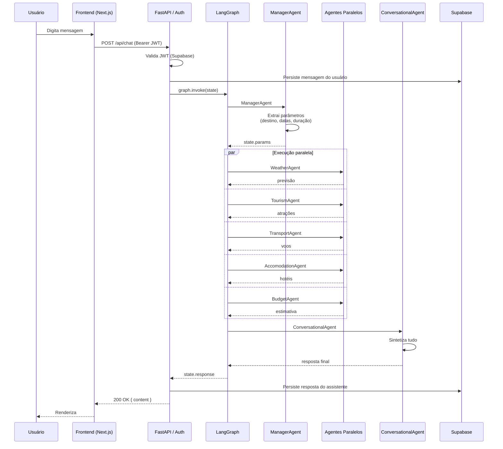

# Arquitetura — Travel Agent IA

Este documento detalha as decisões de arquitetura por trás do projeto, complementando a visão geral do [README](../README.md).

## Visão geral

O Travel-Agent é uma aplicação cliente-servidor com três camadas:

1. **Frontend** (Next.js 16) — interface de chat, autenticação via Supabase, gerenciamento de sessões.
2. **Backend** (FastAPI) — camada REST que recebe mensagens, autentica via JWT, e despacha o trabalho para a camada de agentes.
3. **Camada de agentes** (LangGraph) — grafo de estado coordenando seis agentes especializados, cada um com tools próprias.

O LLM é local (Ollama com `qwen2.5:7b`), o que dá independência de provedores externos e zero custo de inferência durante desenvolvimento.

## Diagrama de sequência

Fluxo completo de uma mensagem `"Quero passar 5 dias em Lisboa em outubro"`:

## StateGraph (LangGraph)

A orquestração é construída em `backend/src/graph/Graph.py` como um `StateGraph` do LangGraph. O estado compartilhado entre nós contém:

- `messages` — histórico da conversa (formato LangChain)
- `params` — parâmetros extraídos pelo ManagerAgent (destino, duração, período, etc.)
- `weather`, `tourism`, `transport`, `accomodation`, `budget` — saídas dos agentes paralelos
- `response` — resposta final do ConversationalAgent

### Por que paralelo

Os agentes `Weather`, `Tourism`, `Transport`, `Accomodation` e `Budget` são independentes — não dependem uns dos outros, apenas dos `params` extraídos pelo Manager. Executá-los em paralelo (via `Send` ou `add_conditional_edges` do LangGraph) reduz a latência total da resposta de `5×T` para `~1×T + síntese`.

### Por que síntese final

O ConversationalAgent existe para resolver um problema clássico de orquestração multiagente: cada agente especialista produz output bom dentro do seu domínio, mas a colagem direta dessas saídas resulta em texto fragmentado e robotizado. O agente de síntese pega todos os outputs estruturados e gera uma resposta única, em tom natural, contextualizando e priorizando o que importa.

## Camada de agentes

Todos os agentes herdam de `BaseAgent` (`backend/src/agents/BaseAgent.py`), que padroniza:

- inicialização do LLM (Ollama via `langchain-ollama`)
- carregamento do system prompt (do diretório `prompts/`)
- formato de invocação (`run(state) -> state`)

### Tools

As tools (`backend/src/tools/`) são wrappers `@tool` do LangChain ao redor de chamadas a APIs externas:

| Tool | API |
|------|-----|
| `WeatherTools.get_forecast` | OpenWeatherMap |
| `TourismTools.get_attractions` | TripAdvisor (via RapidAPI) |
| `TransportTools.search_flights` | TripAdvisor (via RapidAPI) |
| `AccomodationTools.search_hotels` | Booking.com (via RapidAPI) |

Os agentes recebem suas tools via injeção em `App.build_agents()` e as expõem via `bind_tools()` ao LLM, permitindo tool-calling estruturado.

## Autenticação

A autenticação é delegada ao Supabase Auth. O fluxo:

1. Frontend faz login/signup direto na SDK do Supabase, recebe um JWT.
2. Frontend envia o JWT no header `Authorization: Bearer ...` em toda requisição autenticada.
3. Backend valida o JWT usando `SUPABASE_JWT_SECRET` (RS256/HS256) e extrai o `user_id`.
4. As queries no banco respeitam RLS — cada usuário só lê/escreve nas próprias linhas.

## Persistência

Quatro tabelas no PostgreSQL gerenciado pelo Supabase:

- `auth.users` — gerenciada pelo Supabase Auth
- `profiles` — `(user_id, username, email)`, criada via trigger `on_auth_user_created`
- `chat_sessions` — `(id, user_id, title, created_at, updated_at)`
- `chat_messages` — `(id, session_id, role, content, created_at)`

Todas as tabelas têm Row Level Security habilitado. As policies garantem que `auth.uid()` precisa coincidir com `user_id` para qualquer operação.

## Observabilidade

[Langfuse](https://langfuse.com) está integrado via callback handler do LangChain. Cada chamada ao LLM e cada tool-call é capturada como `trace`/`span`, com:

- prompts e respostas completas
- latência por nó do grafo
- consumo de tokens
- metadados do usuário (sem PII)

Em desenvolvimento isso é fundamental para entender o que cada agente está fazendo (e por quê) — debugar prompts cegos é insuportável.

## Limites conhecidos

- **Modelo único** — `qwen2.5:7b` é bom para o tamanho, mas tool-calling com modelos menores ainda erra mais que GPT-4 ou Claude. O roadmap inclui suporte a múltiplos provedores.
- **Sem memória de longo prazo** — cada sessão começa do zero. Adicionar memória persistente (vector store) está no roadmap.
- **Sem testes de integração** — o projeto tem alguns testes unitários, mas nada que exercite o grafo inteiro com LLM real / mockado. Item de roadmap.
- **Sem deploy** — roda só localmente. Voltado pra estudo / portfólio antes de virar SaaS.

## Decisões de stack

| Decisão | Por quê |
|---------|---------|
| Ollama (LLM local) | Custo zero em dev, independência de provedor, modelo cabe em hardware comum |
| LangGraph (não LangChain Agents) | StateGraph dá controle explícito do fluxo, ramos paralelos de primeira classe |
| FastAPI assíncrono | Tooling moderno em Python, OpenAPI grátis, integra bem com LangGraph |
| Supabase | Auth + Postgres + RLS sem operar infra; ideal pra projeto solo |
| Next.js 16 (App Router) | Server components, edge-ready, ecossistema maduro |
| Tailwind + Framer Motion | Velocidade de iteração de UI sem CSS complexo |
